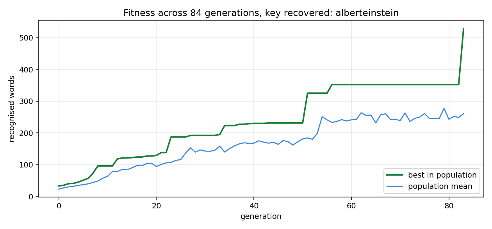

# Vigenere Key Search

Recovers the key of a Vigenere cipher with a genetic algorithm. The key is never
derived analytically. A population of candidates is scored by how much English
each one's decoding produces, and the best are recombined until a candidate
decodes the whole message.



## Requirements

Python 3.10 or later. matplotlib is needed only for the figure.

## Installation

```bash
pip install -e .
```

With the test suite:

```bash
pip install -e ".[dev]"
```

## Usage

```bash
python -m vigenere.cli
```

Defaults to the ciphertext and reference text in `data/`. Options:

| flag | effect |
| --- | --- |
| `--ciphertext` | The encoded message |
| `--reference` | Plain English text the vocabulary is built from |
| `--key-length` | Number of letters in the key |
| `--population` | Candidates per generation, default 60 |
| `--generations` | Give up after this many, default 2000 |
| `--seed` | Seeds the search, so a run is reproducible |

As a library:

```python
import random
from vigenere import KeySearch, load_vocabulary

search = KeySearch(ciphertext, load_vocabulary("data/reference_text.txt"),
                   key_length=14, rng=random.Random(0))
result = search.run()
print(result.key, result.plaintext[:80])
```

## Results

`python -m vigenere.cli`, seed 0, population 60, key length 14.

| | |
| --- | --- |
| key recovered | `alberteinstein` |
| generations | 84 |
| time | 7.7 s |
| search space | 26^14, about 6.4 x 10^19 keys |

The message is the 1939 Einstein-Szilard letter to Roosevelt. Written to
`results/run.json` on every run.

Six or seven decimal orders of magnitude separate a brute force search from
eighty-four generations of sixty candidates, and the reason is visible in the
curve above. Fitness is a count of recognised words, and it rises smoothly rather
than only at the answer: fixing one position of the key makes every letter at
that offset decode correctly, so a partly correct key already produces some real
words. That gradient is what the search climbs.

The shape is a staircase. Long plateaus where no position improves, then a jump
as one letter falls into place, and a final leap from 352 recognised words to 530
when the last position resolves and the whole message becomes English at once.

## Method

**Fitness.** Decode with the candidate key, split into words, count how many
appear in a vocabulary built from a reference text. A candidate is a solution
when every decoded word is recognised.

**Selection.** The population is ranked and the top fifth kept as parents.

**Crossover.** Two-point, at rate 0.65: two cut points are chosen and the middle
segment swapped between parents.

**Mutation.** Each position of a child is replaced with an independent
probability of 0.1, which is what reintroduces letters that selection has bred
out of the whole population.

**Elitism.** The best candidate of a generation is carried into the next
unchanged, so the score can never regress. A test asserts this holds across
successive generations.

## Project structure

```
vigenere/
    cipher.py     encoding and decoding
    corpus.py     word extraction and reference vocabulary
    genetic.py    population, fitness, selection, crossover, mutation
    figures.py    the fitness curve
    cli.py        argument parsing and the search run
tests/            cipher, vocabulary and search behaviour
data/             ciphertexts and the reference text
docs/             figures referenced by this README
results/          the most recent run
pyproject.toml    packaging and the console entry point
```

## Components

| module | responsibility |
| --- | --- |
| `cipher` | Shifting letters by a key, in either direction |
| `corpus` | Turning text into words and a vocabulary |
| `genetic` | Scoring candidates and producing the next generation |
| `figures` | Drawing fitness against generation |
| `cli` | Wiring the pieces together and reporting |

## Testing

```bash
python -m pytest tests/
```

Twenty-five tests covering round-trip encoding, key validation, the requirement
that spacing does not consume key positions, partial keys scoring partially,
crossover and mutation at their limits, elitism never regressing, and an
end-to-end recovery of a short key.
